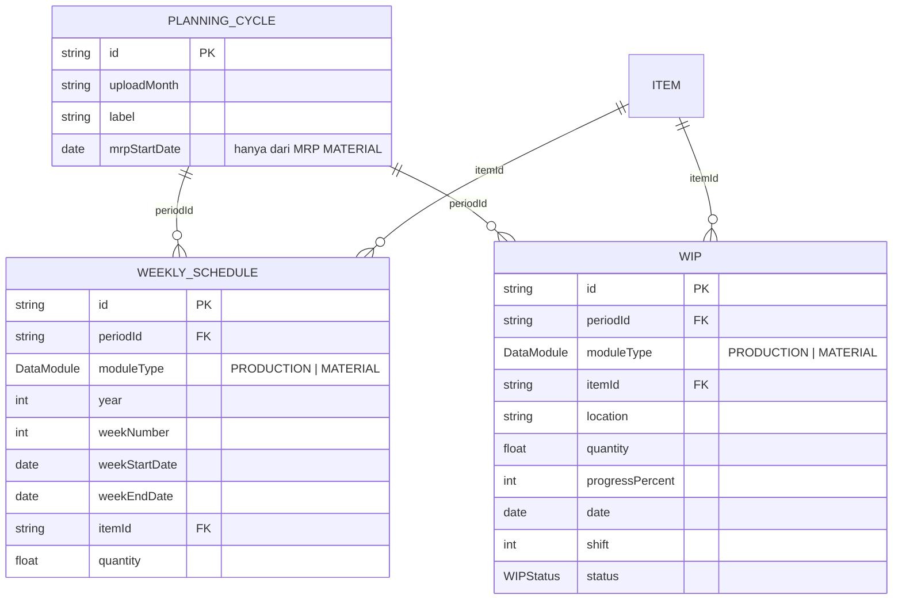

# Pemisahan Data: Production Planning vs Material Planning

**Tanggal:** 2026-09-29
**Cakupan:** Upload **MRP 26 Weeks** (`weekly_schedules`) dan **WIP** (`wips`)
**Status:** ✅ Diterapkan + terverifikasi
**Migrasi:** `20260929000000_module_type`

---

## 1. Ringkasan Akar Masalah

Di aplikasi, menu **Master Data › 26-Week Demand (MRP)** dan **Master Data › Work in
Progress (WIP)** diberi label `Production & Material` — artinya data yang sama dipakai
oleh **Production Planning** dan **Material Planning**.

Secara teknis keduanya memang hanya membaca/menulis **satu tabel** dengan kunci unik
yang **hanya memisahkan per periode**, bukan per modul:

| Tabel | Kunci unik (SEBELUM) | Akibat |
|---|---|---|
| `weekly_schedules` | `(periodId, year, weekNumber, itemId)` | Upload MRP dari Material **MENIMPA** baris MRP Production dengan periode + part + minggu yang sama |
| `wips` | `(periodId, itemId, location)` | Upload WIP dari Material **MENIMPA** baris WIP Production pada part + lokasi yang sama |

**Rantai penyebab:**

1. Tidak ada pembeda modul di level baris data (`weekly_schedules`/`wips` tidak punya
   kolom modul).
2. Upsert memakai kunci `(periodId, …)` saja, jadi part + minggu + lokasi yang sama
   dianggap **satu baris yang sama** walau datang dari modul berbeda.
3. `mode: "overwrite"` menghapus baris dalam satu periode **tanpa membedakan modul**.
4. `recordPeriodChange()` menulis rentang tanggal MRP ke `PlanningCycle.mrpStartDate/
   mrpEndDate` untuk **upload MRP mana pun** → timeline Material Calculation bergeser
   kalau upload MRP Production.
5. Konsumen data tidak eksplisit menyebut modul:
   - Production: `tracking.ts` (Item Tracking, Shortage Detail), `history.ts`
   - Material: `materialPlanning.ts` (`calculate`, `periods`, `data-status`),
     `MaterialCalc.tsx` (sub-folder MRP/WIP)

**Kesimpulan:** masalahnya bukan pada alur upload, tetapi pada **tidak adanya pemilik
modul di level skema**. Perbaikan harus di level database (kunci unik), bukan sekadar
menambah filter di UI.

---

## 2. Pemetaan Proses (SEBELUM → SESUDAH)

| # | Proses | Endpoint / Berkas | SEBELUM | SESUDAH |
|---|---|---|---|---|
| 1 | Upload MRP (Excel) | `POST /weekly-schedule/bulk` · `WeeklyDemand.tsx` | tulis `weekly_schedules` (bersama) | tulis `weekly_schedules` **+ `moduleType`** |
| 2 | Add Demand manual | `POST /weekly-schedule` · `WeeklyDemand.tsx` | idem | idem |
| 3 | Edit MRP | `PUT /weekly-schedule/:id` | idem | idem (baris sudah milik satu modul) |
| 4 | Hapus MRP | `DELETE /weekly-schedule/:id` & `/bulk` | idem | idem |
| 5 | Baca MRP | `GET /weekly-schedule`, `/summary` | tanpa modul | **wajib/pilihan `moduleType`** |
| 6 | Upload/upsert WIP | `POST /wip`, `POST /wip/bulk` · `WIP.tsx` | tulis `wips` (bersama) | tulis `wips` **+ `moduleType`** |
| 7 | Edit/hapus WIP | `PUT/DELETE /wip/:id`, `DELETE /wip/bulk` | idem | idem |
| 8 | Baca WIP | `GET /wip` | tanpa modul | `moduleType` (opsional utk daftar referensi) |
| 9 | Item Tracking | `GET /tracking/item/:code` | `wIP` semua | `wIP` **PRODUCTION** |
| 10 | Dashboard tracking | `GET /tracking/dashboard` | `wIP` semua | `wIP` **PRODUCTION** |
| 11 | Shortage Detail | `GET /tracking/shortage-details` | `wIP` + `weeklySchedule` semua | keduanya **PRODUCTION** |
| 12 | History harian | `GET /history` | `wIP` semua | `wIP` **PRODUCTION** |
| 13 | Hitung Material Calc | `POST /material-planning/cycles/:id/calculate` | `weeklySchedule` + `wIP` semua | keduanya **MATERIAL** |
| 14 | Kelengkapan periode | `GET /material-planning/periods` | 1 angka gabungan | + `moduleCounts` per modul |
| 15 | Validasi STALE | `computePeriodSignature()` | MRP/WIP semua | MRP/WIP **MATERIAL** |
| 16 | Sub-folder MRP/WIP di Material Calc | `usePeriodSourceRows()` | `?periodId=` saja | `?periodId=&moduleType=MATERIAL` |
| 17 | Rentang MRP periode | `recordPeriodChange()` | diisi upload MRP apa pun | hanya MRP **MATERIAL** |
| 18 | Laporan/cetak | `exportPdf.ts`, `MaterialCalc.tsx` | ikut hasil hitung | ikut hasil hitung (sumbernya sudah MATERIAL) |

---

## 3. Keputusan Desain

Dua opsi yang diminta dibandingkan:

### Opsi A — Tabel terpisah (`production_mrp_26weeks`, `material_mrp_26weeks`, …)

```sql
CREATE TABLE production_mrp_26weeks ( … );   -- duplikat struktur
CREATE TABLE material_mrp_26weeks   ( … );
CREATE TABLE production_wip         ( … );
CREATE TABLE material_wip           ( … );
```

**Kelebihan:** pemisahan fisik total; mustahil tercampur.
**Kekurangan:** 4 model Prisma menggantikan 2 (duplikasi skema, relasi `Item`,
`PlanningCycle`, `@@unique`, index); **seluruh** route/hook/tipe/uji harus digandakan
atau diparameterkan per tabel; migrasi data & cleanup dua kali; setiap perubahan
kolom harus disamakan di dua tempat (rawan *drift*).

### Opsi B — Kolom pembeda `moduleType` (**DIPILIH** ✅)

```sql
ALTER TABLE weekly_schedules ADD COLUMN moduleType ENUM('PRODUCTION','MATERIAL') NOT NULL;
ALTER TABLE wips             ADD COLUMN moduleType ENUM('PRODUCTION','MATERIAL') NOT NULL;
```

**Alasan dipilih:**

1. **Kunci unik menjamin isolasi di level database.** `(periodId, moduleType, year,
   weekNumber, itemId)` — part + minggu yang sama **sah** ada di kedua modul dan tidak
   bisa saling menimpa. Aturan yang sama juga untuk WIP.
2. **Konsisten dengan arsitektur yang sudah ada.** Aplikasi ini sudah memakai pola
   "kolom scope + kunci unik berawalan scope" (`periodId`) dan sudah terbukti
   (verifikasi isolasi periode). `moduleType` mengikuti pola yang sama persis.
3. **Tidak ada duplikasi kode.** Satu model, satu route, satu hook; modul hanya menjadi
   parameter. Tidak ada risiko dua definisi yang berbeda diam-diam.
4. **Perubahan minimal & berisiko rendah.** Satu migrasi tambahan (`ADD COLUMN` +
   index), bukan 4 tabel baru beserta seluruh relasinya.
5. **Fleksibel ke depan.** Menambah modul lain (mis. `LOGISTICS`) cukup satu nilai enum.
6. **Defense in depth.** Endpoint tulis **menolak** permintaan tanpa `moduleType`
   (HTTP 400), jadi tidak ada data yang "diam-diam" masuk ke modul yang salah —
   ini kelemahan utama opsi A juga tidak menyelesaikannya (kode tetap bisa menulis
   ke tabel yang salah kalau parameternya tidak dikirim).

### Risiko & mitigasi Opsi B

| Risiko | Mitigasi |
|---|---|
| Satu query lupa memfilter `moduleType` → modul tercampur | `requireModuleType()` untuk **semua** tulis; `resolveModuleType()` untuk baca; tidak ada `@default` di Prisma Client sehingga `create` tanpa `moduleType` **tidak bisa dikompilasi**; uji `verify:module-isolation` |
| `deleteMany` menimpa modul lain | Semua `deleteMany`/`count`/`upsert` kini memakai kunci komposit + filter `moduleType` |
| `mrpStartDate` terisi dari MRP Production | `recordPeriodChange()` hanya mengisi rentang MRP untuk `sourceType='MRP' && moduleType='MATERIAL'` |

---

## 4. Skema Database Baru

### 4.1 ERD



> `DataModule = ENUM('PRODUCTION','MATERIAL')`
> Tabel lain (Hot List, Stock Raw Material, Outstanding PO, NPOF) **tidak berubah** —
> memang hanya milik Material Planning / global.

### 4.2 DDL lengkap (yang diterapkan)

```sql
-- ── 0. Bersihkan data lama (keputusan user: tanpa migrasi data) ─────────────
DELETE FROM `weekly_schedules`;
DELETE FROM `wips`;
DELETE FROM `cycle_results`;          -- hasil hitung lama memakai data bersama
UPDATE `planning_cycles`
SET `status`='DRAFT', `calculatedAt`=NULL, `calculatedBy`=NULL, `calculatedRunCount`=0;

-- ── 1. Kolom pembeda modul ──────────────────────────────────────────────────
ALTER TABLE `weekly_schedules`
  ADD COLUMN `moduleType` ENUM('PRODUCTION','MATERIAL') NOT NULL DEFAULT 'PRODUCTION';
ALTER TABLE `wips`
  ADD COLUMN `moduleType` ENUM('PRODUCTION','MATERIAL') NOT NULL DEFAULT 'PRODUCTION';

-- ── 2. Kunci unik & index per modul ─────────────────────────────────────────
DROP INDEX `weekly_schedules_periodId_year_weekNumber_itemId_key` ON `weekly_schedules`;
DROP INDEX `weekly_schedules_periodId_year_weekNumber_idx`        ON `weekly_schedules`;
CREATE INDEX `weekly_schedules_periodId_moduleType_idx`
  ON `weekly_schedules`(`periodId`,`moduleType`);
CREATE INDEX `weekly_schedules_periodId_moduleType_year_weekNumber_idx`
  ON `weekly_schedules`(`periodId`,`moduleType`,`year`,`weekNumber`);
CREATE UNIQUE INDEX `weekly_schedules_periodId_moduleType_year_weekNumber_itemId_key`
  ON `weekly_schedules`(`periodId`,`moduleType`,`year`,`weekNumber`,`itemId`);

DROP INDEX `wips_periodId_itemId_location_key` ON `wips`;
DROP INDEX `wips_periodId_date_shift_idx`      ON `wips`;
CREATE INDEX `wips_periodId_moduleType_idx`
  ON `wips`(`periodId`,`moduleType`);
CREATE INDEX `wips_periodId_moduleType_date_shift_idx`
  ON `wips`(`periodId`,`moduleType`,`date`,`shift`);
CREATE UNIQUE INDEX `wips_periodId_moduleType_itemId_location_key`
  ON `wips`(`periodId`,`moduleType`,`itemId`,`location`);

-- ── 3. Buang DEFAULT: moduleType WAJIB eksplisit dari aplikasi ──────────────
ALTER TABLE `weekly_schedules` ALTER COLUMN `moduleType` DROP DEFAULT;
ALTER TABLE `wips`             ALTER COLUMN `moduleType` DROP DEFAULT;
```

### 4.3 Referensi cepat

| Sebelum | Sesudah |
|---|---|
| `@@unique([periodId, year, weekNumber, itemId])` | `@@unique([periodId, moduleType, year, weekNumber, itemId])` |
| `@@unique([periodId, itemId, location])` | `@@unique([periodId, moduleType, itemId, location])` |
| key Prisma `periodId_year_weekNumber_itemId` | `periodId_moduleType_year_weekNumber_itemId` |
| key Prisma `periodId_itemId_location` | `periodId_moduleType_itemId_location` |

---

## 5. Perubahan Kode

### 5.1 Backend

| Berkas | Perubahan |
|---|---|
| `prisma/schema.prisma` | `enum DataModule`; `moduleType DataModule` di `WeeklySchedule` & `WIP`; kunci unik + index komposit baru |
| `prisma/migrations/20260929000000_module_type/migration.sql` | **baru** — cleanup + DDL di atas |
| `src/lib/periodScope.ts` | `MODULE_TYPES`, `DataModule`, `MODULE_LABELS`, `parseModuleType()`, `requireModuleType()`, `resolveModuleType()`; `computePeriodSignature(periodId, moduleType)`; `recordPeriodChange({ moduleType })` + hanya MRP MATERIAL yang mengisi rentang MRP |
| `src/routes/weeklySchedule.ts` | `moduleType` di semua endpoint; semua `where`/`upsert`/`deleteMany` memakai kunci komposit baru |
| `src/routes/wip.ts` | idem untuk WIP |
| `src/routes/materialPlanning.ts` | `MATERIAL` sebagai konstan; `countPeriodRows()` & `calculate` & `computePeriodSignature` hanya modul MATERIAL; `/periods` menambah `moduleCounts` |
| `src/routes/tracking.ts` | `wIP` & `weeklySchedule` difilter `moduleType: 'PRODUCTION'` (9 tempat) |
| `src/routes/history.ts` | `wIP` difilter `moduleType: 'PRODUCTION'` |

### 5.2 Frontend

| Berkas | Perubahan |
|---|---|
| `src/components/ModuleSelect.tsx` | **baru** — toggle "Data untuk modul": Production Planning / Material Planning |
| `src/hooks/usePeriods.ts` | tipe `DataModule`, `MODULE_LABELS`, `PeriodSummary.moduleCounts` |
| `src/hooks/useWeeklySchedule.ts` | `useWeeklyScheduleSummary(periodId, moduleType)`; `moduleType` dikirim pada upsert & bulk (query key ikut modul) |
| `src/hooks/useWIP.ts` | `useWIPs(periodId, moduleType)`; `moduleType` dikirim pada upsert & bulk |
| `src/hooks/useMaterialCalc.ts` | `usePeriodSourceRows()` menambah `moduleType=MATERIAL` untuk sumber MRP & WIP |
| `src/routes/WeeklyDemand.tsx` | state `moduleType`; `ModuleSelect` di header, form manual, dan modal Import; hitungan folder pakai `moduleCounts[moduleType]`; notifikasi simpan menyebut nama modul |
| `src/routes/WIP.tsx` | idem untuk WIP |

### 5.3 Aturan untuk pengembang (WAJIB)

1. **Jangan pernah** query `weeklySchedule` / `wIP` tanpa `moduleType` di `where`.
2. Endpoint **tulis** MRP/WIP harus memanggil `requireModuleType(body.moduleType, …)`.
3. Endpoint **baca** data konsumen harus memakai `resolveModuleType()` atau
   `parseModuleType()`.
4. Jangan mengembalikan `@default(PRODUCTION)` ke `moduleType` di `schema.prisma` —
   hilangnya default adalah pengaman agar kode baru tidak lupa mengisi modul.
5. `PlanningCycle.mrpStartDate/mrpEndDate` hanya boleh diisi oleh MRP **MATERIAL**.

---

## 6. Script Pembersihan Data Lama

Sudah menjadi **Langkah 0** di `20260929000000_module_type/migration.sql` sehingga
otomatis dijalankan oleh `prisma migrate deploy` (juga di container lewat
`CMD ["sh","-c","prisma migrate deploy && node dist/server.js"]`).

Bila perlu dijalankan manual / untuk DB produksi yang sudah ter-migrasi:

```sql
-- Jalankan HANYA kalau kolom moduleType belum ada (setelah migrasi, kolomnya ada).
DELETE FROM `weekly_schedules`;
DELETE FROM `wips`;

-- Hasil perhitungan lama dihitung dari data bersama → tidak valid lagi.
DELETE FROM `cycle_results`;

UPDATE `planning_cycles`
SET `status` = 'DRAFT',
    `calculatedAt` = NULL,
    `calculatedBy` = NULL,
    `calculatedRunCount` = 0;
```

Yang **TIDAK** disentuh: `items`, `npof_materials`, `planning_cycles` (hanya status),
`hotlists`, `stock_raw_materials`, `outstanding_pos`, `users`.

Verifikasi setelah pembersihan:

```sql
SELECT moduleType, COUNT(*) FROM weekly_schedules GROUP BY moduleType;  -- kosong
SELECT moduleType, COUNT(*) FROM wips             GROUP BY moduleType;  -- kosong
SELECT COUNT(*) FROM cycle_results;                                     -- 0
SHOW INDEX FROM weekly_schedules WHERE Key_name LIKE '%moduleType%';    -- 3 index
SHOW INDEX FROM wips             WHERE Key_name LIKE '%moduleType%';    -- 3 index
```

---

## 7. Checklist Pengujian

### 7.1 Otomatis (sudah dijalankan, semua LULUS)

```bash
pnpm --filter @pdits/api verify:module-isolation   # 34 pemeriksaan — BARU, semua LULUS
pnpm --filter @pdits/api verify:cycle-isolation    # 17 pemeriksaan — regresi periode, semua LULUS
pnpm --filter @pdits/api verify:material-calc      # mesin kalkulasi (lihat catatan drift di bawah)
pnpm --filter @pdits/api verify:po-number          # 47 pemeriksaan — semua LULUS
pnpm --filter @pdits/api typecheck
pnpm --filter @pdits/web exec tsc -b
```

> ⚠️ **Catatan `verify:material-calc`:** 2 pemeriksaan di *Bagian C* gagal
> (`jumlah kebutuhan NPOF dengan ukuran valid` 108 → **123** dan `part yang dapat
> stok pada toleransi 2 cm` 31 → **40**). Ini **drift data nyata**, bukan regresi:
> Bagian C hanya membaca `npof_materials` + `stock_raw_materials` (tidak menyentuh
> MRP/WIP sama sekali), dan jumlah baris NPOF di database sudah tumbuh
> **357 → 402** sejak angka snapshot itu dicatat (2026-09-28). Angka yang sama
> sudah bergeser sekali sebelumnya (98 → 108 dan 29 → 31) karena upload ulang
> data master. Perbaikan: perbarui konstanta snapshot setelah data master final.

`verify:module-isolation` membuat periode uji `2031-02`, membuktikan:

- [x] Upload MRP PRODUCTION (qty 100) & MATERIAL (qty 999) → **dua himpunan baris terpisah**
- [x] Part + minggu yang sama sah ada di **kedua modul** (kunci unik per modul)
- [x] WIP part + lokasi yang sama sah ada di **kedua modul** (qty 10 vs 20)
- [x] **Edit** baris PRODUCTION → MATERIAL **tidak berubah**
- [x] **Upload ulang** MATERIAL → PRODUCTION **tidak berubah**
- [x] **Hapus** baris PRODUCTION → MATERIAL **tetap utuh**
- [x] **Hapus** WIP PRODUCTION → WIP MATERIAL **tetap utuh**
- [x] Upload **tanpa** `moduleType` → **HTTP 400** (begitu juga nilai tidak valid)
- [x] `GET /weekly-schedule/summary` memfilter per modul
- [x] `GET /material-planning/periods` memberi `moduleCounts` terpisah
- [x] `npof_materials` **tidak berubah**
- [x] Periode & item uji terhapus bersih

### 7.2 Manual di browser (sudah diverifikasi)

- [x] Halaman **26-Week Demand**: toggle modul tampil; folder periode menampilkan
      "N baris MRP Production Planning" → berubah jadi "… Material Planning" saat toggle diklik
- [x] Halaman **WIP**: toggle modul tampil; kartu periode menampilkan
      "N Baris WIP Production Planning" → "… Material Planning"
- [x] Buka isi folder periode menampilkan tabel data modul yang sedang dipilih
- [x] Tidak ada console error

### 7.3 Checklist yang perlu dijalankan user setelah upload ulang file nyata

| # | Langkah | Hasil yang diharapkan |
|---|---|---|
| 1 | Master Data › 26-Week Demand → modul **Production Planning** → Import Excel (file MRP Production) | folder periode menunjukkan jumlah baris MRP Production Planning |
| 2 | Master Data › 26-Week Demand → modul **Material Planning** → Import Excel (file MRP Material) | jumlah baris MRP Material Planning **berbeda**; angka Production **tidak berubah** |
| 3 | Master Data › WIP → modul **Production** → Import Excel | jumlah baris WIP Production Planning |
| 4 | Master Data › WIP → modul **Material** → Import Excel | jumlah baris WIP Material Planning; WIP Production **tidak berubah** |
| 5 | Edit 1 baris MRP di modul Production | baris Material **tidak berubah** |
| 6 | Hapus semua baris MRP modul Production | baris Material **tetap ada** |
| 7 | Material Planning › Material Calculation → pilih periode → "Hitung" | perhitungan memakai MRP + WIP **modul Material** |
| 8 | Production Planning › Item Tracking & Shortage Detail | angka WIP yang tampil = **modul Production** |
| 9 | Bandingkan angka WIP di halaman Item Tracking dengan halaman Material Calculation | boleh berbeda — memang sumbernya beda |
| 10 | Coba upload via API **tanpa** `moduleType` | ditolak **400** dengan pesan jelas |
| 11 | `npx prisma migrate status` | "Database schema is up to date!" |

---

## 8. Catatan Operasional

- **Upload wajib memilih modul.** Tombol simpan di form/import tetap aktif seperti
  biasa, tetapi karena `moduleType` selalu dikirim oleh UI, tidak ada upload yang
  ambigu. Di API, permintaan tanpa `moduleType` ditolak 400.
- **Halaman Master Item › WIP Locations** sengaja membaca **kedua** modul
  (`GET /wip` tanpa `moduleType`) karena hanya memakai **daftar nama lokasi**,
  bukan angka WIP.
- **Badge `Production & Material`** di sidebar tetap dipertahankan: benar bahwa
  *menu*-nya dipakai kedua modul — yang dipisah adalah *datanya*.
- `cycle_results` lama dihapus karena dihitung dari data bersama. Setelah migrasi,
  semua periode berstatus `DRAFT` dan perlu dihitung ulang.
- Migrasi ini **tidak** mengubah `hotlists` / `stock_raw_materials` / `outstanding_pos`
  (memang hanya milik Material Planning) dan **tidak** menyentuh `npof_materials`
  (sumber global yang dipakai bersama semua periode).
